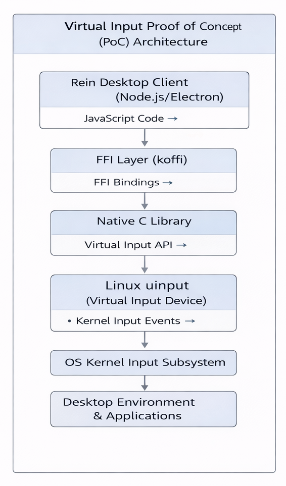
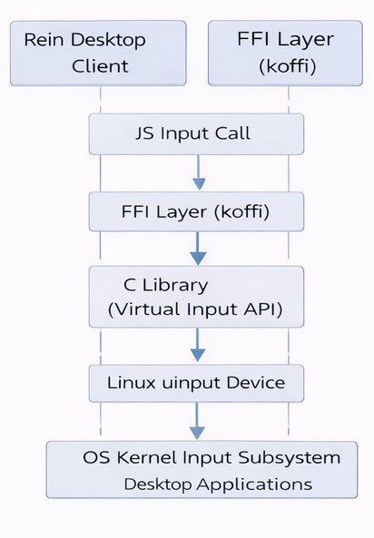

# Virtual Input Device PoC (Rein)

## Overview

This Proof of Concept demonstrates system-level input injection using virtual input devices instead of high-level automation libraries like Nut.js.

The goal is to achieve **low-latency, OS-native, and reliable input handling**.

---

## Objective

* Replace high-level input simulation
* Use Linux `uinput` for system-level injection
* Ensure compatibility with Wayland

---

## Architecture

### Virtual Input Architecture



### Virtual Input Sequence Diagram



---

## Tech Stack

* Node.js / Electron
* TypeScript
* Koffi (FFI bindings)
* C (uinput)
* WebRTC

---

## Setup & Installation

### 1. Clone Repo

```bash
git clone https://github.com/AOSSIE-Org/Rein.git 
cd Rein
git checkout feat/poc-remote-input-linux
```

### 2. Install Dependencies

```bash
npm install
```

### 3. Enable uinput (Linux only)

```bash
sudo modprobe uinput
```

### 4. Run Project

```bash
npm run dev
```

---

## Features

* Native cursor movement
* OS-level input recognition
* Works with Wayland
* End-to-end pipeline validated

---

## Results

* Input treated as real hardware input
* Smooth cursor control
* Better than Nut.js approach

---

## Limitations

* Fully implemented only on Linux
* Windows/macOS partially tested

---

## Demo Videos

* Linux: 

    Laptop Recording (Ubuntu: Cursor Invisible due to security): 
        https://drive.google.com/file/d/1CEw7P8JJlfGaabio_Beca8UTtOvKzsMt/view?usp=sharing 

    Mobile Recording: 
        https://drive.google.com/file/d/1jIHynSEv6IfRa9ZOjNqHFQhzLEvlKvPn/view?usp=sharing 

* Windows: https://drive.google.com/file/d/1xt_8kwLBRAFyeTvYr0lnGG1ewVlHcPBA/view?usp=sharing 

* macOS: https://drive.google.com/file/d/1Ge42-nw8dC9gCPqga6FcUtoERbpStqE4/view?usp=sharing

---

## Future Work

* Windows (SendInput)
* macOS (Quartz Events)
* Gesture support

---

## Author

Vinayak S Dhulubulu
