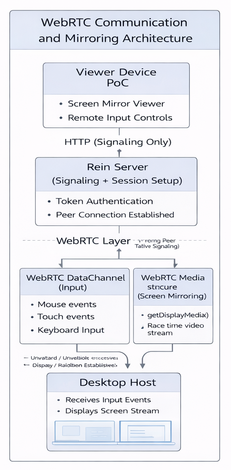
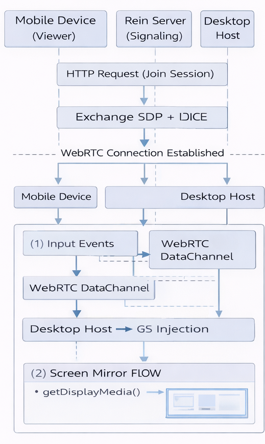

# WebRTC Communication & Screen Mirroring PoC (Rein)

## Overview

This Proof of Concept validates **low-latency peer-to-peer communication** and **real-time screen mirroring** using WebRTC.

---

## Objective

* Replace WebSockets with WebRTC
* Achieve real-time input transmission
* Enable screen mirroring

---

## Architecture

### WebRTC Architecture



### WebRTC Sequence Diagram



---

## Tech Stack

* WebRTC
* Node.js / Electron
* TypeScript

---

## Setup & Installation

### 1. Clone Repo

```bash
git clone https://github.com/AOSSIE-Org/Rein.git
cd Rein
git checkout webrtc-poc
```

### 2. Install Dependencies

```bash
npm install
```

### 3. Run Project

```bash
npm run dev
```

---

## How It Works

1. Join session via HTTP signaling
2. WebRTC connection established
3. Input sent via DataChannel
4. Screen streamed via MediaStream
5. Desktop receives input + sends video

---

## Features

* Low-latency communication
* Real-time screen mirroring
* Peer-to-peer connection
* Minimal server dependency

---

## Results

* Smooth screen streaming
* Fast input response
* Reduced latency vs WebSockets

---

## Limitations

* NAT/firewall issues possible
* TURN server not implemented

---

## Demo Videos

* Windows: https://drive.google.com/file/d/1IeuWh8KSiJPnyYc2lfb5LbFI6Qpz-PZ0/view?usp=sharing 

* Linux: https://drive.google.com/file/d/19QBhAIrHgqj68TSNrfXmwZRmDsKG9GNo/view?usp=sharing 

* macOS: https://drive.google.com/file/d/1_zuh72BvQxGJOmqoS45hB1DiFrd_ZsBg/view?usp=sharing 

---

## Future Work

* TURN server support
* Bitrate optimization
* Stability improvements

---

## Author

Vinayak S Dhulubulu
